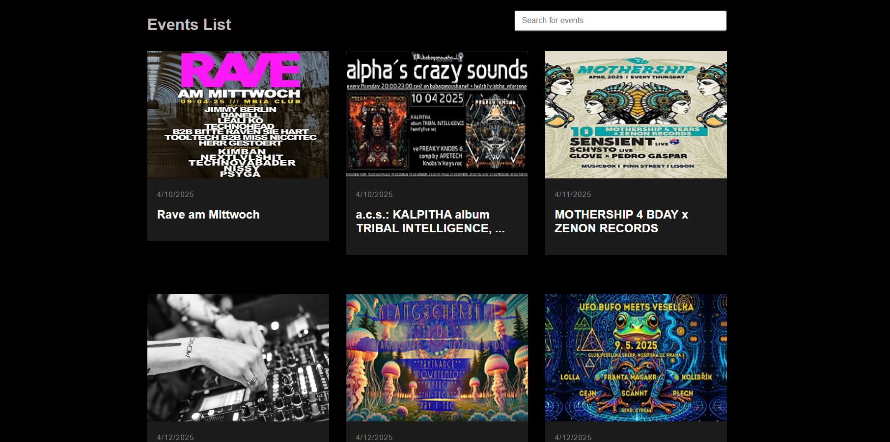

# DJ Website 🎵

Welcome to the **DJ Website**, a React-based platform designed to showcase upcoming music events, parties, and festivals. This project is built with modern web technologies to provide a seamless and interactive user experience.



## Features

- 🎶 **Event Listings**: Browse through a list of upcoming music events and parties.
- 🔍 **Search Functionality**: Search for events by name or keywords.
- 🕒 **Real-Time Loading**: Displays a loading spinner while fetching event data.
- 📅 **Event Details**: View detailed information about each event, including date, description, and links.
- 🌐 **Responsive Design**: Fully responsive and optimized for all devices.

## Getting Started

This project was bootstrapped with [Create React App](https://github.com/facebook/create-react-app).

### Prerequisites

Make sure you have the following installed on your system:

- [Node.js](https://nodejs.org/) (v14 or higher)
- [npm](https://www.npmjs.com/) or [yarn](https://yarnpkg.com/)

### Installation

1. Clone the repository:
   ```bash
   git clone https://github.com/your-username/dj-website.git
   cd dj-website
   ```
